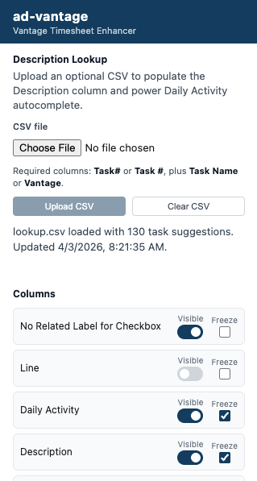
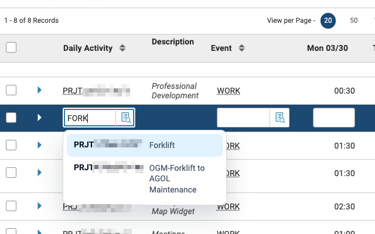
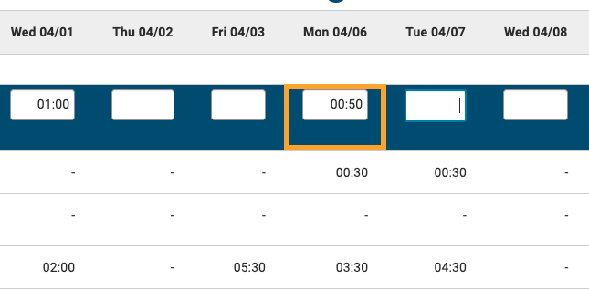

# ad-vantage

A Chrome extension that makes the [Vantage timesheet app](https://vantage.utah.gov/) easier to use — freeze and hide columns, add task descriptions, and get autocomplete while entering daily activities.

## Features

- **Frozen columns** — Keep key columns like employee name and project code pinned while you scroll horizontally through date columns.
- **Hidden columns** — Declutter your view by hiding columns you don't need.
- **Description lookup column** — Add an optional column that displays task descriptions pulled from a CSV file you upload.
- **Daily Activity autocomplete** — Get suggestions as you type in the Daily Activity field, sourced from your uploaded lookup data.
- **Update Timesheet shortcut** — On `Timesheet (TIMEI)` in the `Daily Activity` tab, adds an `Update Timesheet` button next to the lower three-dot menu so you can trigger the native action in one click.
- **Quarter-hour warnings** — Time cells that don't end in `:00`, `:15`, `:30`, or `:45` are highlighted with an orange outline, helping you catch accidental decimal-style entries.
- Works on both `vantage.utah.gov` and `vantage.access.utah.gov` (for non-state networks).

<p align="center"></p>

Type-ahead search for tasks based on description:

<p align="center"></p>

Warnings for non-quarter-hour time entries:

<p align="center"></p>

## Installation

Install directly from the [Chrome Web Store](https://chromewebstore.google.com/detail/ad-vantage/hhilhapkdkgcgbippfodmdldmlnihkgp).

The extension icon will appear in your Chrome toolbar. It is only active when you are on the Vantage site.

## Usage

1. **Navigate to Vantage** at `https://vantage.utah.gov/` (or `https://vantage.access.utah.gov/`).
2. The extension activates automatically — columns are frozen and your saved visibility preferences are applied.
3. **Click the extension icon** in your Chrome toolbar to open the popup, where you can:
   - Show or hide individual columns.
   - Upload or replace the description lookup CSV.
4. On `Timesheet (TIMEI)` with the `Daily Activity` grid visible, use the added `Update Timesheet` button beside the lower three-dot menu to run the same native update action without opening the menu first.

### Description Lookup CSV

Uploading a CSV file enables the Description column and Daily Activity autocomplete.

- The CSV must include a `Task#` (or `Task #`) column and either a `Task Name` or `Vantage` column.
- Your uploaded data is stored locally in `chrome.storage.local` — it stays in your current Chrome profile and is never synced to other devices.
- To disable description lookups, clear the uploaded file from the popup.

---

## Developer Guide

### Prerequisites

- [Node.js](https://nodejs.org/) v18 or higher
- [pnpm](https://pnpm.io/) (install with `npm install -g pnpm` or via [other methods](https://pnpm.io/installation))

### Local Development

1. **Install dependencies:**

   ```bash
   pnpm install
   ```

2. **Start the development server:**

   ```bash
   pnpm dev
   ```

   This starts the Vite dev server with HMR via `@crxjs/vite-plugin`. Extension files are written to `dist-dev` and require `http://localhost:5173` to remain running.

3. **Launch the dedicated debug browser:**

   ```bash
   pnpm chrome:dev
   ```

   Opens Google Chrome Dev with remote debugging on `http://127.0.0.1:9223`. Keep this browser open while using MCP-based browser inspection.

4. In the Chrome Dev window, go to `chrome://extensions/`, enable **Developer mode**, and load the `dist-dev` folder as an unpacked extension.

5. Log in to Vantage in that same Chrome Dev window.

6. Reload VS Code after the browser is running so the MCP server in `.vscode/mcp.json` can connect.

You can verify the remote debugging endpoint with:

```bash
curl http://127.0.0.1:9223/json/version
```

> If Chrome Dev is already running without the remote debugging flag, macOS may reuse the existing instance and ignore the new launch arguments. Quit Chrome Dev and run `pnpm chrome:dev` again.

### Production Build

```bash
pnpm build
```

Bundles and minifies the extension into the `dist` folder. Load `dist` as an unpacked extension in `chrome://extensions/` to test the production build.

### Chrome Web Store

The release workflow can publish new versions to the Chrome Web Store after the first manual submission.

#### First-Time Store Setup

1. Create a Chrome Web Store developer account and enable 2-step verification.
2. Run `pnpm build`.
3. Upload the `dist` contents as a new item in the Chrome Web Store dashboard.
4. Complete the listing, privacy, and distribution sections, then submit so Google assigns a permanent extension ID.

#### Automated Publishing via GitHub Actions

Add these repository secrets to enable automated publishing on release:

- `CWS_CLIENT_ID`
- `CWS_CLIENT_SECRET`
- `CWS_REFRESH_TOKEN`
- `CWS_PUBLISHER_ID`
- `CWS_EXTENSION_ID`

If any secret is missing, the release workflow still uploads the built zip to GitHub Releases and skips the Chrome Web Store step.

To generate the OAuth credentials:

1. In Google Cloud, enable the Chrome Web Store API.
2. Configure an OAuth consent screen and create an OAuth client.
3. Generate a refresh token with the `https://www.googleapis.com/auth/chromewebstore` scope.
4. Copy your publisher ID from the Chrome Web Store developer dashboard and the extension ID from the published item.

Once configured, each published GitHub release will build the extension, zip `dist`, upload the archive to GitHub Releases, and submit it to the Chrome Web Store for review.

### Releases

Releases are managed with `agrc/release-composite-action` via GitHub Actions using conventional commits.

| Commit type | Release bump |
| ----------- | ------------ |
| `feat`      | minor        |
| `fix`       | patch        |
| `docs`      | patch        |
| `style`     | patch        |
| `deps`      | patch        |

- Pushes to `dev` create or update prerelease PRs and tags.
- Pushes to `main` create or update stable release PRs and tags.
- Merging a release PR publishes the release and uploads the built extension archive.

Use squash merges so the PR title becomes the changelog entry. The workflow automatically bumps the version in `package.json` and `manifest.json` — do not edit those files manually to cut a release.
